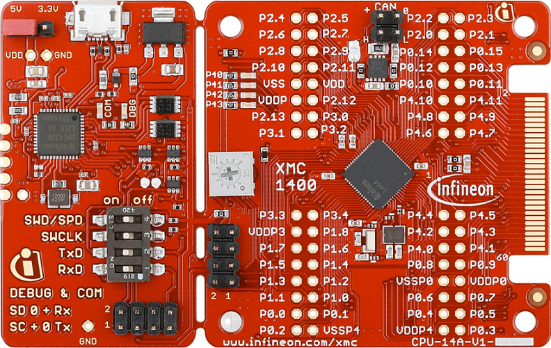

# KIT_XMC14_BOOT_001 BSP

## Overview

This is Early Access Software for XMC devices in ModusToolbox. This software is made available for evaluation purposes only and is not recommended for production development. 
The XMC1400 Boot Kit (CPU-14A-V1) houses the XMC1400 Microcontroller and a 2x30 pin edge for application expansion.

To use code from the BSP, simply include a reference to `cybsp.h`.

## Features

### Kit Features:

* XMC1400 (ARM Cortex-M0 based) Microcontroller in a VQFN64 package
* On board Debugger for downloading and debugging of application code
* Virtual COM port for UART communication with terminal program e.g. Hyperterminal
* 2x30 card edge connector for extension to application card e.g. Colour LED Card and White LED Card
* 4 User LEDs connected to GPIO P4.0, P4.1, P4.2, P4.3
* Variable resistor R110 connected to analog input P2.5
* All the pins of XMC1400 are accessible via the connector JP101, JP103, JP104 and JP105
* CAN interface with CAN transceiver mounted
* External crystal 20 MHz and 32.768 kHz mounted

### Kit Contents:

* KIT_XMC14_BOOT_001 evaluation board

## BSP Configuration

The BSP has a few hooks that allow its behavior to be configured. Some of these items are enabled by default while others must be explicitly enabled. Items enabled by default are specified in the KIT_XMC14_BOOT_001.mk file. The items that are enabled can be changed by creating a custom BSP or by editing the application makefile.

Components:
    * Device specific category reference (e.g.: CAT1) - This component, enabled by default, pulls in any device specific code for this board.
    * BSP_DESIGN_MODUS - This component, enabled by default, causes the Configurator generated code for this specific BSP to be included. This should not be used at the same time as the CUSTOM_DESIGN_MODUS component.
    * CUSTOM_DESIGN_MODUS - This component, disabled by default, causes the Configurator generated code from the application to be included. This assumes that the application provides configurator generated code. This should not be used at the same time as the BSP_DESIGN_MODUS component.

Defines:
    * CYBSP_WIFI_CAPABLE - This define, disabled by default, causes the BSP to initialize the interface to an onboard wireless chip.
    * CY_USING_HAL - This define, enabled by default, specifies that the HAL is intended to be used by the application. This will cause the BSP to include the applicable header file and to initialize the system level drivers.

### Clock Configuration

| Clock    | Source    | Output Frequency |
|----------|-----------|------------------|

### Power Configuration

## API Reference Manual

The KIT_XMC14_BOOT_001 Board Support Package provides a set of APIs to configure, initialize and use the board resources.

See the [BSP API Reference Manual][api] for the complete list of the provided interfaces.

## More information
* [KIT_XMC14_BOOT_001 BSP API Reference Manual][api]
* [KIT_XMC14_BOOT_001 Documentation](https://www.infineon.com/cms/en/product/evaluation-boards/kit_xmc14_boot_001/)
* [Cypress Semiconductor, an Infineon Technologies Company](http://www.cypress.com)
* [Cypress Semiconductor GitHub](https://github.com/cypresssemiconductorco)
* [ModusToolbox](https://www.cypress.com/products/modustoolbox-software-environment)

[api]: https://cypresssemiconductorco.github.io/TARGET_KIT_XMC14_BOOT_001/html/modules.html

---
© Cypress Semiconductor Corporation, 2019-2020.